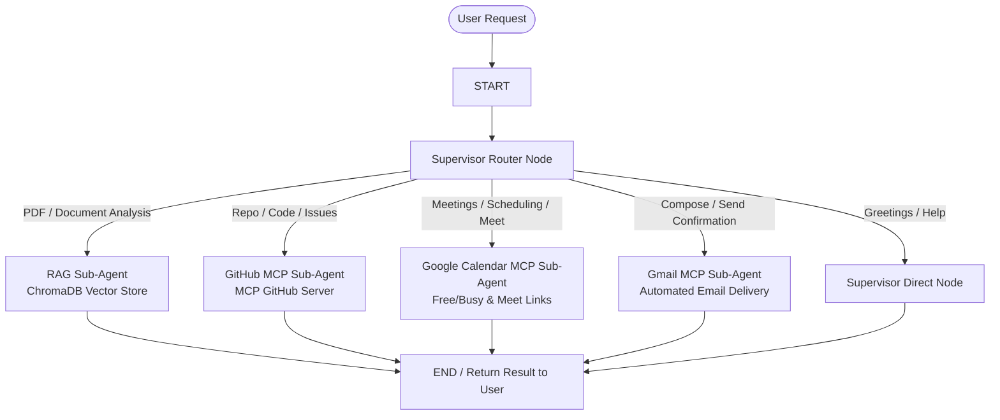

# LangGraph Multi-Agent Architecture: 1 Supervisor + 4 Sub-Agents

An enterprise-grade, modular multi-agent system built using **LangGraph StateGraph**, **Model Context Protocol (MCP)**, and **ChromaDB**. The system features a centralized intelligent **Supervisor** that classifies user requests and delegates tasks to **four specialized sub-agents**.

---

## Architecture Overview



---

## Sub-Agent Specifications

### STEP 1 — RAG Sub-Agent (`agents/rag_agent.py`)
- **PDF Ingestion Pipeline**: Ingests any PDF document from local disk, extracts text per page using `pypdf`, and chunks it using `RecursiveCharacterTextSplitter` (1,000 characters with 200-character overlap).
- **ChromaDB Vector Store**: Indexes chunks into a persistent vector collection with deterministic or OpenAI embeddings.
- **Retrieval Tool**: Exposes `search_pdf_knowledge` with top-k similarity search, citation headers, and page numbers.
- **Strict Grounding Enforcement**: Configured with a system prompt requiring answers to be derived **exclusively** from the retrieved context. If a queried fact is missing, the agent outputs:
  > *"I cannot find that information in the provided document."*

### STEP 2 — GitHub MCP Sub-Agent (`agents/github_agent.py` & `mcp_servers/github_mcp.py`)
- **MCP Server Connection**: Conforms to the Anthropic/Linux Foundation Model Context Protocol (MCP 2.x). Connects to GitHub API (or official `@modelcontextprotocol/server-github` via stdio).
- **Repository Discovery**:
  - `github_search_repositories`: Search open-source projects by keyword, topic, or organization.
  - `github_get_repository`: Discover stars, forks, language, open issues, default branch, and license.
  - `github_list_issues`: Inspect bug reports, feature requests, and discussions.
  - `github_list_pull_requests`: Track code submissions and pull requests.
  - `github_get_file_contents`: Read README, source files, or inspect repository directory trees.
  - `github_list_commits`: View commit history and change logs.
  - `github_create_issue`: Open new issues on GitHub.
- **LangGraph ReAct Agent**: Formulates queries, executes tools iteratively, and returns comprehensive repository summaries.

### STEP 3 — Google Calendar MCP Sub-Agent (`agents/calendar_agent.py` & `mcp_servers/calendar_mcp.py`)
- **Google Calendar MCP Server**: Connects via Google Calendar v3 API (or realistic zero-setup sandbox environment).
- **Core Capabilities**:
  - **Read Meetings with Google Meet**: `calendar_list_meetings` retrieves upcoming or past meetings and extracts Google Meet video conferencing links (`hangoutLink`).
  - **Availability Verification (Free/Busy)**: `calendar_check_availability` checks for scheduling conflicts over any ISO 8601 time window to prevent double booking.
  - **Automated Scheduling**: `calendar_create_meeting` books events at specific times with attendee lists, descriptions, and automatic Google Meet video room creation (`conferenceDataVersion=1`).

### STEP 4 — Email (Gmail) MCP Sub-Agent (`agents/email_agent.py` & `mcp_servers/gmail_mcp.py`)
- **Gmail MCP Server**: Connects via Gmail v1 API (or sandbox mailbox for offline validation).
- **Core Capabilities**:
  - **Draft Composition**: `gmail_write_email_draft` writes structured email drafts to any recipient.
  - **Automated Email Sending**: `gmail_send_email` automatically sends emails to confirm or schedule meetings at specific times, notify attendees with Google Meet links, or deliver project updates.
  - **Inbox & Sent Querying**: `gmail_list_recent_emails` inspects sent items and received confirmations.

### STEP 5 — Supervisor Graph (`supervisor/graph.py`)
- **LangGraph StateGraph Orchestrator**: Manages state transitions and chat memory (`AgentState`).
- **Classification & Routing**:
  - The supervisor node analyzes the user's intent using structured output or heuristic intent matching.
  - Routes the request to **exactly one** of the four sub-agents (`rag_agent`, `github_agent`, `calendar_agent`, `email_agent`, or `FINISH`).
  - The selected sub-agent executes its tools, synthesizes the result, and returns the response directly to the user.

---

## Directory Structure

```
├── config/
│   ├── __init__.py
│   └── settings.py              # Environment configuration & paths
├── core/
│   ├── __init__.py
│   ├── llm.py                   # LLM & Embeddings factory + OfflineToolCallingLLM
│   ├── state.py                 # LangGraph AgentState TypedDict definition
│   └── mcp_adapter.py           # Universal MCP to LangChain tool bridge
├── mcp_servers/
│   ├── __init__.py
│   ├── github_mcp.py            # GitHub MCP Server (Stdio & In-process)
│   ├── calendar_mcp.py          # Google Calendar MCP Server (Google Meet & Free/Busy)
│   └── gmail_mcp.py             # Gmail MCP Server (Email drafts & automated dispatch)
├── agents/
│   ├── __init__.py
│   ├── rag_agent.py             # Step 1: PDF Loader + ChromaDB + Strict ReAct Agent
│   ├── github_agent.py          # Step 2: GitHub MCP ReAct Sub-Agent
│   ├── calendar_agent.py        # Step 3: Google Calendar MCP ReAct Sub-Agent
│   └── email_agent.py           # Step 4: Gmail MCP ReAct Sub-Agent
├── supervisor/
│   ├── __init__.py
│   └── graph.py                 # Step 5: LangGraph Supervisor StateGraph
├── data/
│   ├── sample_documents/
│   │   └── sample_agent_guide.pdf # Auto-generated test PDF document
│   └── chroma_db/               # Persistent Chroma vector store
├── tests/
│   ├── test_rag.py              # Tests PDF loading, Chroma indexing & strict retrieval
│   ├── test_github.py           # Tests GitHub search, repo details & issues
│   ├── test_calendar.py         # Tests Google Meet extraction, Free/Busy & scheduling
│   ├── test_gmail.py            # Tests drafting & sending automated emails
│   └── test_supervisor.py       # Tests supervisor routing decisions & StateGraph flow
├── scripts/
│   └── generate_sample_pdf.py   # Utility to generate test PDFs using ReportLab
├── main.py                      # Interactive CLI, automated demo, & chat runner
├── requirements.txt             # Pinned project dependencies
├── .env.example                 # Configuration template with all API keys
└── README.md                    # Comprehensive documentation & architecture guide
```

---

## Getting Started

### 1. Prerequisites
- Python 3.10+ (Python 3.12 recommended)
- Git

### 2. Environment Setup

```bash
# Clone the repository
git clone <repo-url>
cd <repo-folder>

# Create and activate virtual environment
python -m venv .venv

# On Windows:
.venv\Scripts\activate

# On Linux/macOS:
source .venv/bin/activate

# Install all dependencies
pip install -r requirements.txt
```

### 3. Configure Environment Variables
Copy `.env.example` to `.env`:

```bash
cp .env.example .env
```

Open `.env` and fill in your API keys (optional for sandbox demo):
```ini
OPENAI_API_KEY=your_openai_api_key_here
GITHUB_TOKEN=your_github_personal_access_token_here
GOOGLE_CREDENTIALS_FILE=credentials.json
```

> **Zero-Config Sandbox Mode:** If you do not have an OpenAI API key or Google credentials right away, the system automatically activates the built-in **`OfflineToolCallingLLM`** and **sandbox mock databases**. You can run the entire multi-agent system and tests immediately!

---

## Running the Multi-Agent System

### 1. Run the Automated Demo
Executes end-to-end demonstrations across all 4 sub-agents:
```bash
python main.py --demo
```

### 2. Interactive Terminal Chat Mode
Launches a rich interactive console chat where you can talk to the Supervisor:
```bash
python main.py --chat
```

### 3. Interactive Menu Mode
Launches an interactive menu with quick-action presets:
```bash
python main.py
```

### 4. Single-Query Execution
Run an ad-hoc request through the supervisor from your terminal:
```bash
# Test RAG Sub-Agent
python main.py --query "What is the benchmark score in the PDF document?"

# Test GitHub Sub-Agent
python main.py --query "Discover key details of the repository langchain-ai/langgraph"

# Test Calendar Sub-Agent
python main.py --query "List my upcoming Google Calendar meetings and show the Google Meet links"

# Test Email Sub-Agent
python main.py --query "Send an email to alex@company.com to confirm our meeting tomorrow at 2 PM"
```

### 5. Ingest a Custom PDF Document
Load your own PDF into the Chroma vector store:
```bash
python main.py --ingest "path/to/your_document.pdf"
```

---

## Running the Test Suite

Run the full automated test suite covering all sub-agents and the supervisor graph:

```bash
python -m unittest discover -s tests -p "test_*.py"
```

All 21 test cases validate:
- RAG PDF chunking, Chroma embedding, and strict factual retrieval.
- GitHub MCP repository inspection, file reading, and issue tracking.
- Google Calendar MCP Google Meet link generation, free/busy availability detection, and meeting creation.
- Gmail MCP email composition, automated dispatch, and delivery status verification.
- Supervisor routing classification and LangGraph StateGraph execution.

---

## License
MIT License. Created for autonomous multi-agent orchestration with LangGraph and Model Context Protocol (MCP).


<!-- Implementation Details by Step
STEP 1 — RAG Sub-Agent (

rag_agent.py
)
PDF Vector Store Pipeline: Ingests any local PDF via 

pypdf
, chunks using RecursiveCharacterTextSplitter (1,000 chunk size, 200 overlap), and indexes embeddings into ChromaDB (

data/chroma_db/
).
Retrieval Tool: Exposes search_pdf_knowledge with top-k similarity search, citation headers, and page numbers.
Strict Grounding Enforcement: Prompt mandates answering strictly from retrieved excerpts. If the information is missing from the document, it outputs:
"I cannot find that information in the provided document."

STEP 2 — GitHub MCP Sub-Agent (

github_agent.py
 & 

github_mcp.py
)
MCP Server: Connects to the GitHub Model Context Protocol server.
Tools:
github_search_repositories: Search open-source projects by keyword, topic, or organization.
github_get_repository: Discover stars, forks, language, open issues, default branch, and license.
github_list_issues: Inspect bug reports, feature requests, and discussions.
github_list_pull_requests: Review contributions and open pull requests.
github_get_file_contents: Read README, source files, or inspect repository directory trees.
github_list_commits: View commit history and change logs.
github_create_issue: Open new issues on GitHub.
ReAct Agent: Formulates multi-step queries, inspects repositories, and delivers structured reports.
STEP 3 — Google Calendar MCP Sub-Agent (

calendar_agent.py
 & 

calendar_mcp.py
)
MCP Server: Implements Google Calendar v3 API with sandbox fallback.
Tools:
calendar_list_meetings: Reads upcoming or past meetings, extracting attendees and Google Meet links (hangoutLink).
calendar_check_availability: Queries free/busy windows before scheduling to prevent double-booking.
calendar_create_meeting: Schedules events at specified ISO 8601 times with automatic Google Meet video links (conferenceDataVersion=1).
STEP 4 — Email (Gmail) MCP Sub-Agent (

email_agent.py
 & 

gmail_mcp.py
)
MCP Server: Implements Gmail API with sandbox fallback.
Tools:
gmail_write_email_draft: Composes and stores formatted drafts with subject, body, and CC.
gmail_send_email: Automatically sends emails to confirm/schedule meetings, deliver Meet links, or send messages.
gmail_list_recent_emails: Inspects sent items and inbox for delivery confirmation.
STEP 5 — Supervisor Graph (

graph.py
)
StateGraph Orchestrator: Uses 

AgentState
 to manage message history and routing.
Classifier & Conditional Routing:
Supervisor inspects the user's intent (via structured output or heuristic classifier).
Routes to exactly one of the four sub-agents (rag_agent, github_agent, calendar_agent, email_agent, or FINISH).
The sub-agent executes its tools, synthesizes the answer, and returns it directly to the user.
STEP 6 — Configuration & Documentation


requirements.txt
: Pinned dependencies (langgraph, langchain, chromadb, mcp, pypdf, rich, Google API libraries).


.env.example
: Environment variable template for OpenAI, GitHub tokens, and Google OAuth credentials.


README.md
: Architecture breakdown, setup guides, and sample queries.


main.py
: Rich terminal interface with interactive chat, single query CLI, and automated demo. -->
